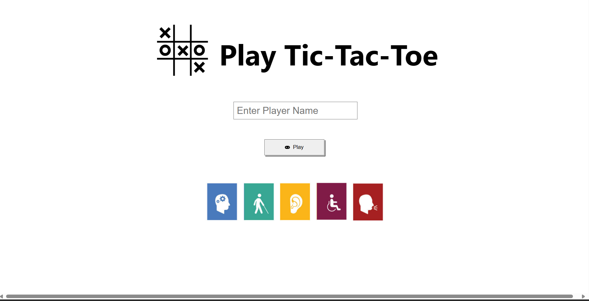

# tic-tac-toe
Accessible tic-tac-toe

This webapp is created using ReactJs as the frontend and SpringBoot as the backend.

## User Usage

The first page the users see is the login page where the user enters their player name. Upon clicking play, the user will enter the next page which is the game page.

The game page will provide users with 3 options. 

Th first option would be to create a game whereby the player will be given a unique game id. An alert would pop up to provide the user with the game id. Additionally, the caption, which is below the tic-tac-toe board game, will be updated to show the game ID, and to let the player know that he/she is waiting for an opponent.

The second option is to allow the player to connect to a game with a specific game ID. User will enter the unique game id into the input box before clicking the connect button. Again, an alert would pop up if the user gets connected successfully, together with the caption, to instruct the user to make the first move.

The last option would be to connect to a random game. By clicking the connect to a random game button, the user will be connected to a random game. As of now, the user would be connected to a game that has been created but has not been connected to by any other player. In this case, the alert and caption will display . If there are no available games, a game will be created the alert and caption will indicate to the user that there are no available opponents and that the user is currently waiting for an available opponent. 

Once 2 users are connected, they will proceed to play the game. For each move a player makes, the caption will display the description of the move. When there is a winner or a draw occurs, players will be alerted that the game has ended and the caption will state who has won the game. User can then click on any of the 3 options above to start another game. 

Additionally, users can navigate to the game history page by clicking the game history button. On this page, all the previous games played by the player as well as his/her moves as well as the opponent's moves will be displayed. There is a back to game navigation button to navigate back to the game page.

The game page also has an end session navigation button where user will be brought back to the login page. By clicking the button, the session will end and the user's game history will be lost. To play again, the user can login by entering the player name and clicking play to start a new session.

## Accessibility
To incorporate accessibility, a few measures were taken:
    -  Buttons with icons were used so as to gave players a better understanding of ths function of the buttons
    -  Buttons upon hovering will be grey scaled
    -  Buttons should change its color upon clicking
    -  Alerts are given during the game session to give players a better understanding of the game state
    -  Semantic HTML was used as much as possible 
    -  Aria attributes were incorporated into html and css
    -  Captions are displayed throughout game session for players to better understand the game state

Below is the link of the walkthrough video of the web application using NVDA Screen Reader

## Running the program 
To run the application locally, 
1. Clone the repository to your local desktop
2. 

## API Functions

## Architecture diagram

## Future developments

refresh. to login.sometimes when refresh, login details is lost, disrupt caption.
websocket disconnection.
long wait for websocket to be stablished. 