# tic-tac-toe
Accessible tic-tac-toe

This webapp is created using ReactJs as the frontend and SpringBoot as the backend.

## User Usage

The first page the users see is the login page where the user enters their player name. Upon clicking play, the user will enter the next page which is the game page.

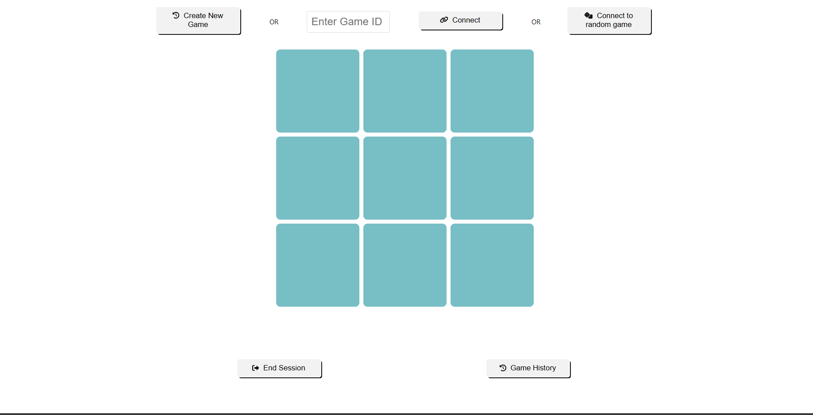
The game page will provide users with 3 options. 

Th first option would be to create a game whereby the player will be given a unique game id. An alert would pop up to provide the user with the game id. Additionally, the caption, which is below the tic-tac-toe board game, will be updated to show the game ID, and to let the player know that he/she is waiting for an opponent.

The second option is to allow the player to connect to a game with a specific game ID. User will enter the unique game id into the input box before clicking the connect button. Again, an alert would pop up if the user gets connected successfully, together with the caption, to instruct the user to make the first move.

The last option would be to connect to a random game. By clicking the connect to a random game button, the user will be connected to a random game. As of now, the user would be connected to a game that has been created but has not been connected to by any other player. In this case, the alert and caption will display . If there are no available games, a game will be created the alert and caption will indicate to the user that there are no available opponents and that the user is currently waiting for an available opponent. 

Once 2 users are connected, they will proceed to play the game. For each move a player makes, the caption will display the description of the move. When there is a winner or a draw occurs, players will be alerted that the game has ended and the caption will state who has won the game. User can then click on any of the 3 options above to start another game. 

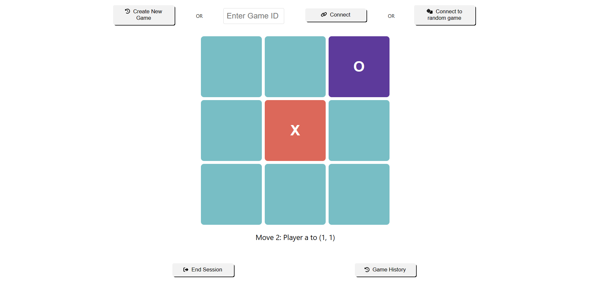

Additionally, users can navigate to the game history page by clicking the game history button. On this page, all the previous games played by the player as well as his/her moves as well as the opponent's moves will be displayed. There is a back to game navigation button to navigate back to the game page.

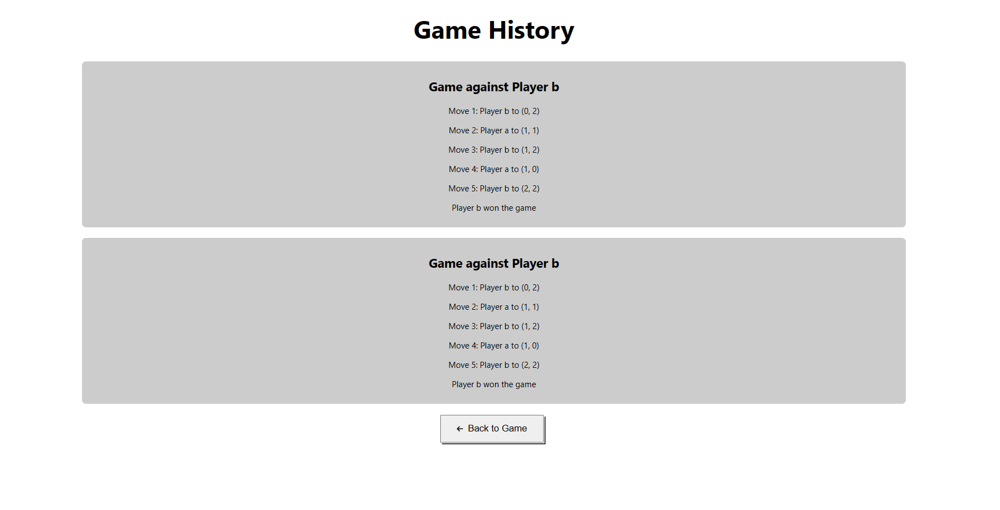

The game page also has an end session navigation button where user will be brought back to the login page. By clicking the button, the session will end and the user's game history will be lost. To play again, the user can login by entering the player name and clicking play to start a new session.

## Accessibility

To incorporate accessibility, a few measures were taken:
1. Buttons with icons were used so as to gave players a better understanding of ths function of the buttons
2. Buttons upon hovering will be grey scaled
3. Buttons should change its color upon clicking
4. Alerts are given during the game session to give players a better understanding of the game state
5. Semantic HTML was used as much as possible 
6. Aria attributes were incorporated into html and css
7. Captions are displayed throughout game session for players to better understand the game state
8. Colors chosen were at least contrast of Aa or above

Captions legend for game moves:
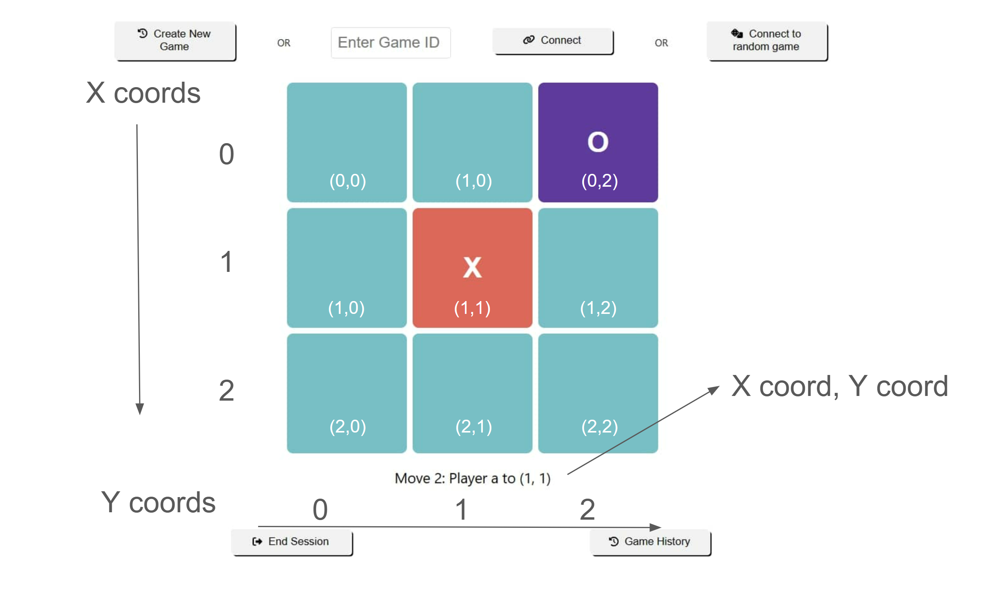

Below is the link of the walkthrough video of the web application using NVDA Screen Reader
https://drive.google.com/file/d/1hzgMEkrVFn7WwK7iYQ4X71fLfF3v_EAO/view?usp=sharing

## Running the program 

To view the deployed webapp: https://tic-tac-toe-accessibility-d5868a1101a7.herokuapp.com/

To run the application locally, 
1. Clone the repository to your local desktop
2. Navigate to Maven project to run maven commands, mvn clean install package
3. Navigate to target folder and right click on the tic-tac-toe-0.0.1-SNAPSHOT.jar file and select copy path
4. Run the following commands on your terminal "java -jar "(paste from copy path)"". This should run the program.

A more detailed walkthrough is given in the video link above (at the time of the video the webapp has not been deployed)

## API Functions

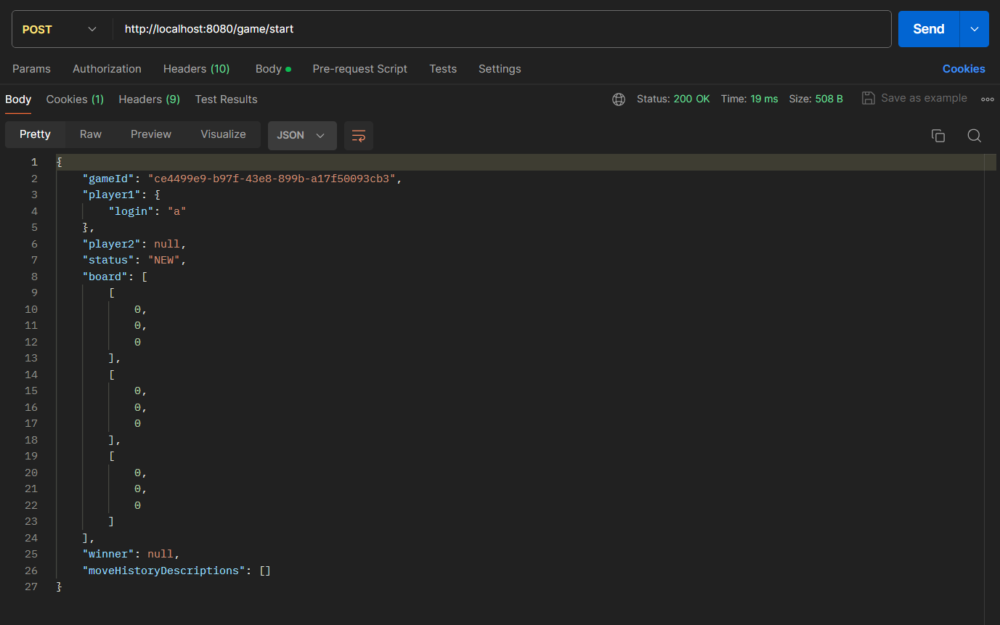
Post Method for http://localhost:8080/game/start initialises game which is used in the createGame function in the GamePage component.

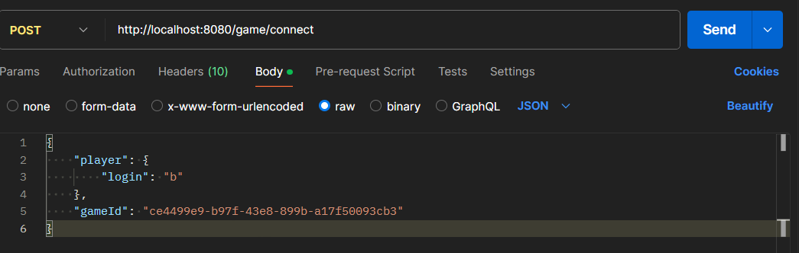
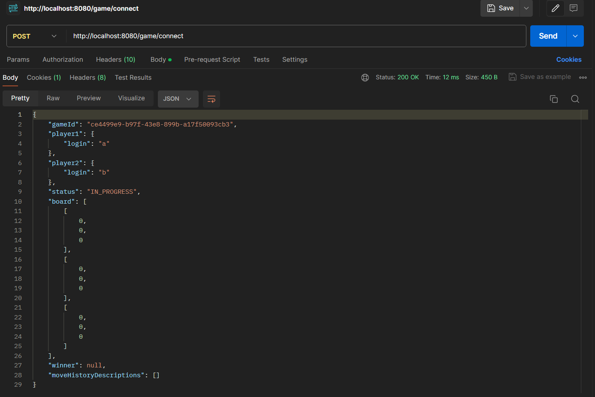
Post Method for http://localhost:8080/game/connect connects the user to a specific game if passed in the gameid property. This is used in the connectToSpecificGame function in the Game Page component

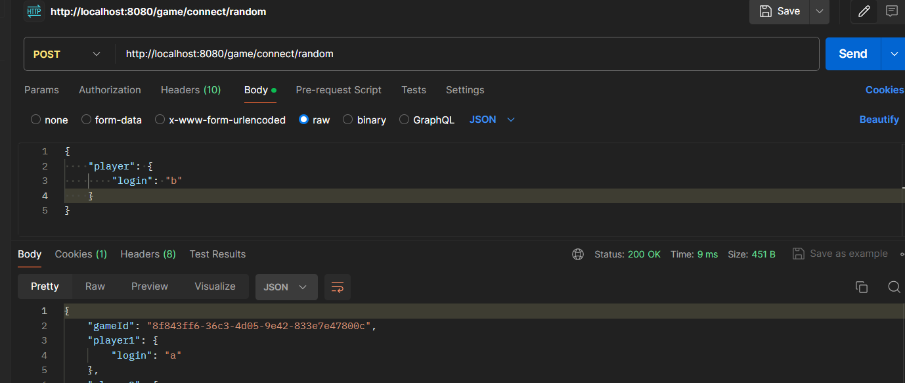
Post Method for http://localhost:8080/game/connect/random either connects user to a game that already has been created or creates a new game if there are no available games to be connected to. his is used in the connectToRandomGame function in the Game Page component

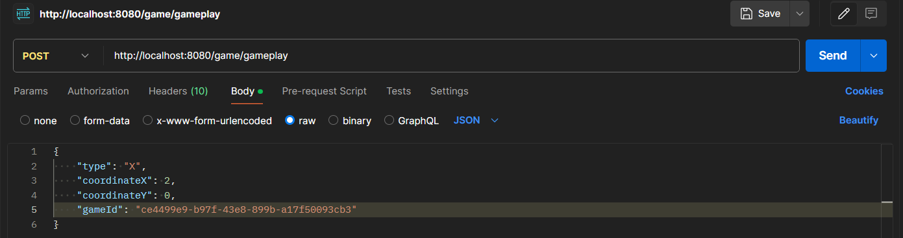
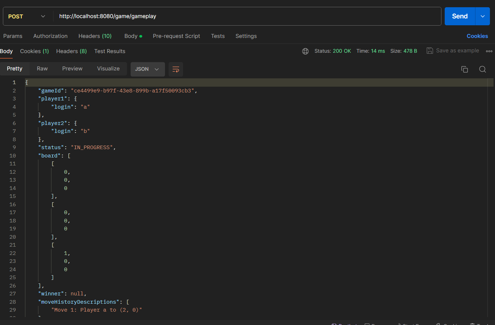
Post Method for http://localhost:8080/game/gameplay updates the game state which is used in makeAMove function in GamePage component. the player type, coordinate X and coordinate Y and game id is passed into the the api function. The function returns a game class (game.java). 

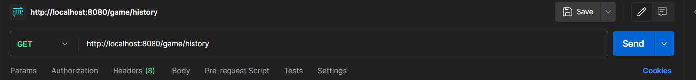
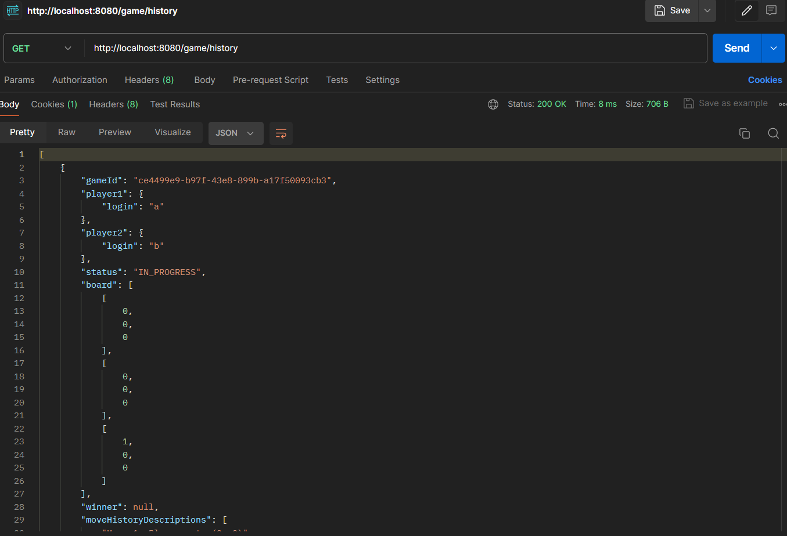
Get Method for http://localhost:8080/game/history retrieves the game history for that game session. The function returns a list of previous games. 
The post function for http://localhost:8080/game/newSession creates a new session.

All the API functions are in the GameController.java file

## Architecture diagram

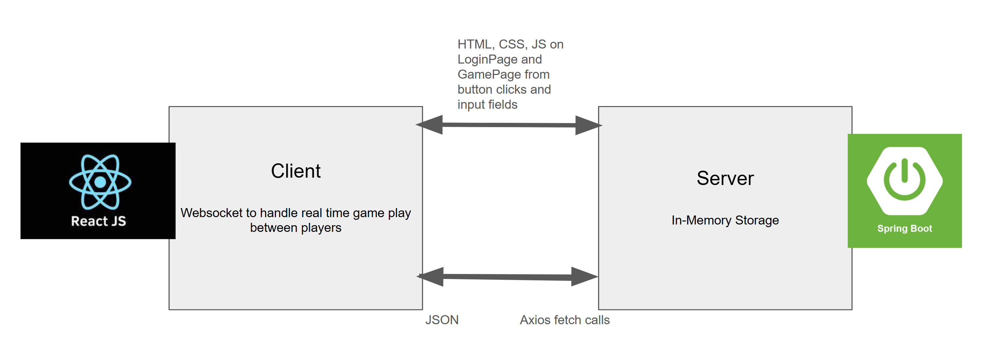

## Short summary on design/infra decisions

The architecture of this web application is centered around simplicity and accessibility, structured across three main pages: login, game, and history. This straightforward navigation aids users, particularly those with disabilities, in understanding the app’s workflow.

Accessibility features are emphasized through a custom button component with descriptive icons, aiding users in recognizing their function quickly. The buttons also provide visual feedback via color changes, assisting users with visual impairments.

The game board is interactive, with square colors changing to signify player moves, employing a color scheme chosen for its high contrast to accommodate color vision deficiencies (default square - blue, X - red, O - purple). Game state changes are communicated through clear captions and alerts, facilitating user comprehension.

Semantic HTML and ARIA roles are implemented to enhance the accessibility of the content. Colors are chosen to comply with AA contrast standards to ensure readability.

The server architecture utilizes in-memory storage, considering the casual nature of tic-tac-toe and obviating the need for persistent user accounts. This design allows for a session-based approach to game history, simplifying the user experience by avoiding the complexity of account management and continuous data storage. It is also to prevent the need for users to stress over remembering their login details and can enter the game page once they key in their player name. As such, the game history is only stored for that session until user decides to end session (by navigating to login page or exiting the browser)

Real-time game interactions are enabled through WebSocket, ensuring a responsive and synchronized gaming experience for users. ReactJS is used for the frontend while SpringBoot is used for the backend. The frontend is packaged inside the SpringBoot project to run on the same port and eliminate the CORS problem when fetching data from backend.

## Future developments

1. Incorporate specific sounds for when a move is made on the tic tac toe board
2. Handle websocket disconnection logic, user should be navigated back to login page while the other user should be notified of disconnection
 
